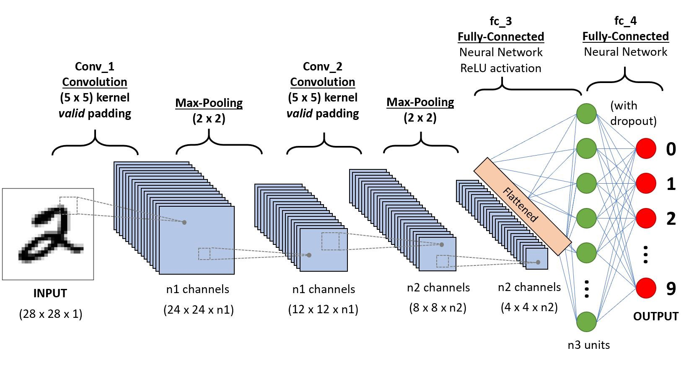

# Cats Vs Dogs

## Initial Setup

<br />

Virtual Environment ([Python Docs](https://docs.python.org/3/library/venv.html))
- Create: `python -m venv .\venv`
- Activate: `venv\Scripts\Activate.ps1`
- Deactivate: `deactivate`

[Jupyter in VS Code](https://code.visualstudio.com/docs/datascience/jupyter-notebooks)

[Tutorial Playlist](https://www.youtube.com/playlist?list=PLUc_7x68VCSN_WNoeAnfydLL22sYyobgW)

[Dataset (PetImages directory)](https://www.microsoft.com/en-us/download/details.aspx?id=54765)

<br />

## Preprocess Data

<br />

### Video 1 of 3

Install numpy: `pip install numpy`
- used for array computation
Install OpenCV packages for Python: `pip install opencv-python`
- used for converting images into arrays

Why do we need to resize images when training a model?
[Link](https://towardsdatascience.com/3-things-you-need-to-know-before-working-with-images-in-machine-learning-6a2ab6f6b822)
1. CNNs only function when images have the same dimensions
2. Reduce computational cost by resizing images and removing colour (using grayscale)
3. Increase amount of training data using image augmentation (e.g. rotate images)

How to grayscale image cv2?
[Link](https://techtutorialsx.com/2018/06/02/python-opencv-converting-an-image-to-gray-scale/)
- `image = cv2.imread(path)`
- `gray = cv2.cvtColor(image, cv2.COLOR_BGR2GRAY)`

Why does cv2 grayscale make image green?
[Link](https://stackoverflow.com/questions/57798054/why-do-i-get-a-green-image-when-i-convert-an-rgb-image-to-grayscale-using-opencv)
- `plt.imshow(image, cmap='gray')`

Some images in dataset were causing

```
error: OpenCV(4.8.0) D:\a\opencv-python\opencv-python\opencv\modules\imgproc\src\resize.cpp:4062: error: (-215:Assertion failed) !ssize.empty() in function 'cv::resize'
```

so added check for None before resizing image.

<br />

## Training Model

<br />

### Video 2 of 3

Why divide by 255 when training model?
[Link](https://www.reddit.com/r/tensorflow/comments/ohosac/tf2_quickstart_why_do_we_divide_by_255/)
- normalizes data to improve speed of calculations
- further research suggests there are better normalization methods

What is a CNN?
[Link](https://www.analyticsvidhya.com/blog/2020/10/what-is-the-convolutional-neural-network-architecture/)


The grayscale I set to images as part of Video 1 was causing an error while training, so I commented it out for now.
- With grayscale, image shape was (100, 100). Without grayscale, image shape is (100, 100, 3).

<br />

### Video 3 of 3

All about training multiple models and comparing with TensorBoard. Skimmed through it.

<br />

### Saving and Loading

How to save a TensorFlow model?
[Link](https://www.tensorflow.org/tutorials/keras/save_and_load#save_the_entire_model)
- `model.save('model')`
- `new_model = tf.keras.models.load_model('model')`

<br />

## Test Model

<br />

### Testing with Single Images

How to make a prediction with a single image?
[Link](https://www.youtube.com/watch?v=79R_4GhQIbs)
